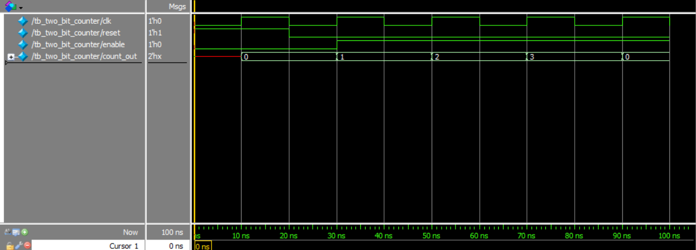

# 2-Bit Synchronous Counter in SystemVerilog

## Project Overview

This repository contains a basic 2-bit synchronous counter designed in SystemVerilog. The counter includes an active-high reset and an enable signal. A comprehensive testbench is also provided to verify the counter's functionality through a directed test sequence.

## Key Concepts Practiced

This project served as a hands-on exercise for the following fundamental concepts in digital design and verification:

* **RTL Design**: The counter is implemented using an `always_ff` block, demonstrating the standard practice for modeling synchronous, edge-triggered logic (flip-flops). Non-blocking assignments (`<=`) are used to prevent race conditions and correctly model register behavior.

* **Testbench Architecture**: The verification environment is built with parallel processes using multiple `initial` blocks—one for clock generation and another for stimulus and monitoring. This showcases how to create concurrent, independent testbench operations.

* **Verification & Debugging**: This project highlights the difference between two key SystemVerilog system tasks:
    * `$display` is used for single, event-based messages, acting like a snapshot 📸 to print information at a specific point in time (e.g., "Test finished").
    * `$monitor` is used for continuous signal tracing, acting like a live feed 📹 that automatically prints a message whenever a watched signal's value changes.

## Simulation Waveform

The following waveform shows the counter resetting to `00`, then incrementing on each positive clock edge while `enable` is high. The count correctly wraps from `11` back to `00`.

## Future Work

The current design is a fixed 2-bit counter. A key improvement would be to parameterize the module's width. By using a `parameter` for the bit-width, the same module could be instantiated as a 4-bit, 8-bit, or N-bit counter, making the design significantly more reusable.
