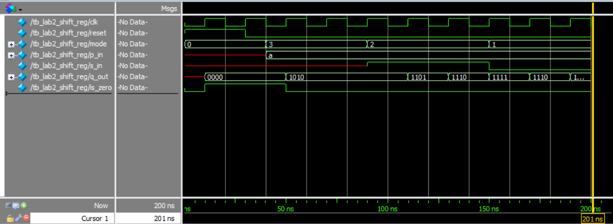

# 4-Bit Universal Shift Register in SystemVerilog

A 4-bit synchronous universal shift register with a parallel load and an active-high reset. The project includes a self-checking testbench to verify all modes of operation.

### Features
The register supports four modes selected by a 2-bit `mode` input:
* **`00`**: Hold state
* **`01`**: Shift left
* **`10`**: Shift right
* **`11`**: Parallel load

### Implementation
The core logic is implemented within a single `always_ff` block using a `case` statement for mode selection.

### Simulation Waveform
The waveform below demonstrates the reset, parallel load, and shift operations.

